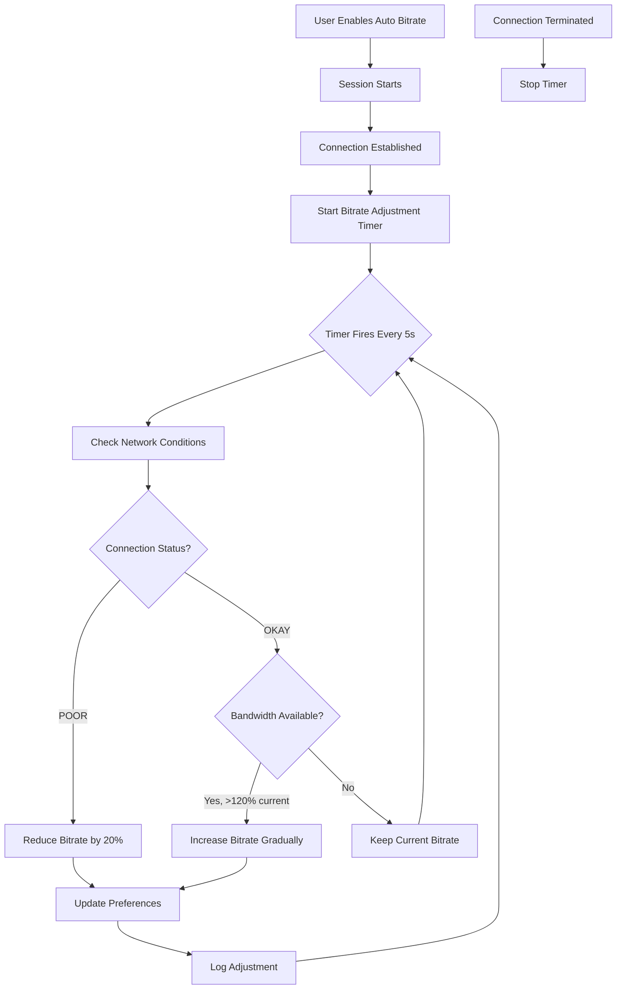
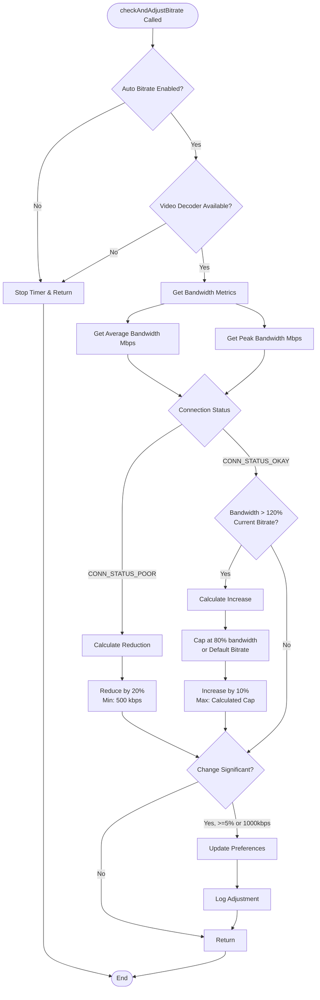
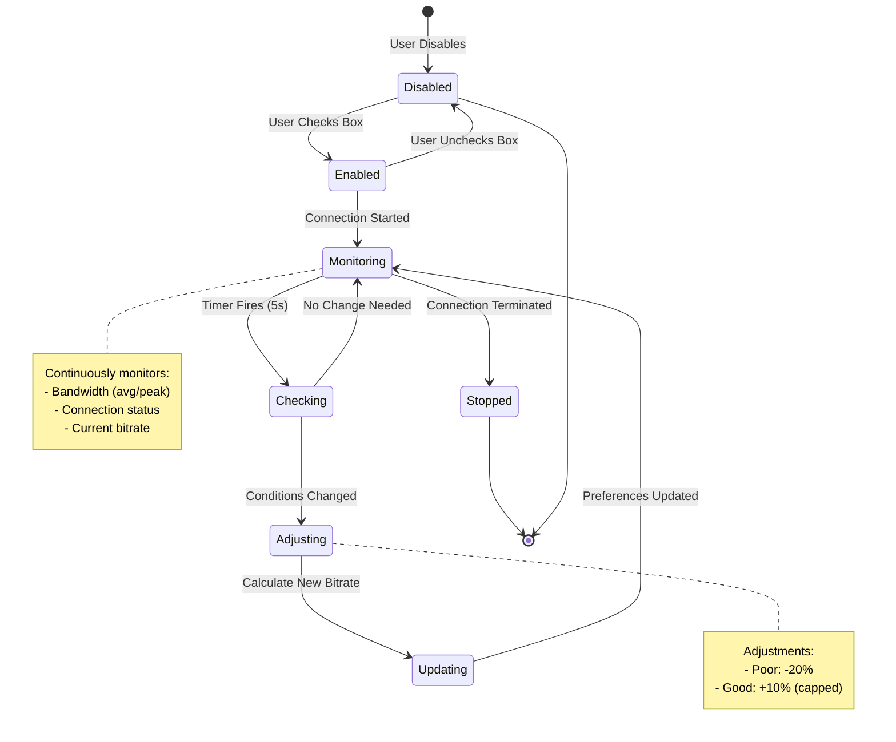
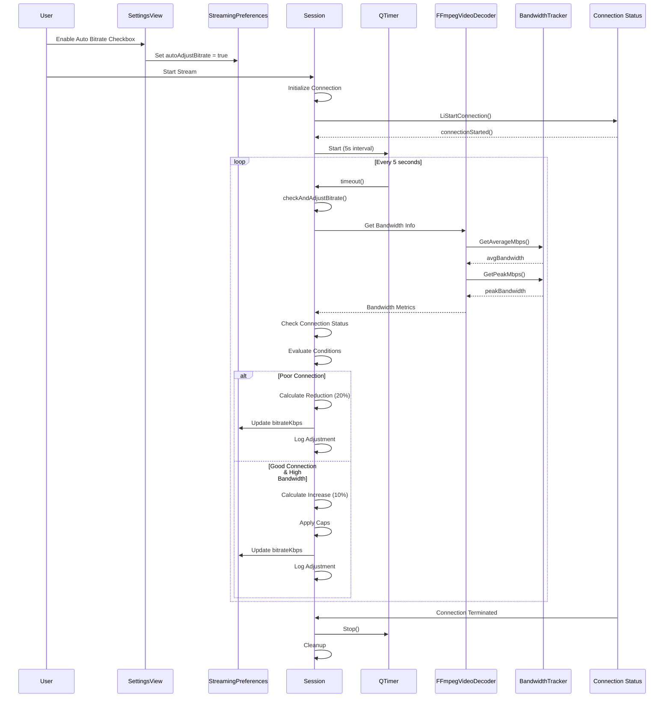
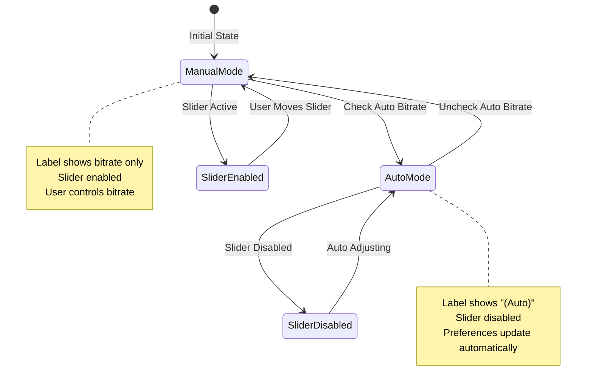

# Auto Bitrate Feature Design Document

## Overview

The Auto Bitrate feature automatically adjusts video streaming bitrate based on real-time network conditions during an active streaming session. This ensures optimal streaming quality by dynamically adapting to available bandwidth and connection quality.

## Goals

- **Adaptive Quality**: Automatically adjust bitrate to match network conditions
- **User-Friendly**: Simple checkbox toggle in settings UI
- **Non-Disruptive**: Updates preferences for future sessions without interrupting current stream
- **Intelligent**: Uses multiple signals (bandwidth tracking, connection status) for decision-making

## Architecture

### Components

```
┌─────────────────────────────────────────────────────────────┐
│                      User Interface                         │
│  ┌──────────────────────────────────────────────────────┐  │
│  │  SettingsView.qml                                    │  │
│  │  - Auto Bitrate Checkbox                             │  │
│  │  - Bitrate Slider (disabled when auto enabled)      │  │
│  │  - Bitrate Display Label                            │  │
│  └──────────────────────────────────────────────────────┘  │
└─────────────────────────────────────────────────────────────┘
                            │
                            │ Preferences
                            ▼
┌─────────────────────────────────────────────────────────────┐
│              StreamingPreferences                          │
│  - autoAdjustBitrate: bool                                 │
│  - bitrateKbps: int                                       │
└─────────────────────────────────────────────────────────────┘
                            │
                            │ Used by
                            ▼
┌─────────────────────────────────────────────────────────────┐
│                    Session Class                            │
│  ┌──────────────────────────────────────────────────────┐  │
│  │  - QTimer* m_BitrateAdjustTimer                      │  │
│  │  - int m_LastConnectionStatus                        │  │
│  │  - int m_LastAdjustedBitrate                         │  │
│  │  - checkAndAdjustBitrate()                           │  │
│  └──────────────────────────────────────────────────────┘  │
└─────────────────────────────────────────────────────────────┘
                            │
                            │ Monitors
                            ▼
┌─────────────────────────────────────────────────────────────┐
│              Network Condition Sources                      │
│  ┌──────────────────────┐  ┌──────────────────────────┐  │
│  │ BandwidthTracker     │  │ Connection Status         │  │
│  │ - GetAverageMbps()   │  │ - CONN_STATUS_POOR        │  │
│  │ - GetPeakMbps()       │  │ - CONN_STATUS_OKAY        │  │
│  └──────────────────────┘  └──────────────────────────┘  │
└─────────────────────────────────────────────────────────────┘
```

## System Flow

### High-Level Flow Diagram



### Detailed Bitrate Adjustment Flow



## State Diagram



## Sequence Diagram



## Network Condition Monitoring

### Bandwidth Tracking

The `BandwidthTracker` class maintains a sliding window of network throughput:

- **Window Size**: 10 seconds
- **Bucket Interval**: 250ms
- **Average Calculation**: Uses most recent 25% of buckets (2.5 seconds)
- **Peak Calculation**: Highest throughput in any single bucket

### Connection Status

The Limelight library provides connection status updates:

- `CONN_STATUS_POOR`: Network conditions are degraded
- `CONN_STATUS_OKAY`: Network conditions are acceptable

These status updates trigger immediate bitrate adjustment checks.

## Bitrate Adjustment Logic

### Reduction Strategy (Poor Connection)

When `CONN_STATUS_POOR` is detected:

1. **Calculation**: `newBitrate = currentBitrate × 0.8`
2. **Minimum**: Never go below 500 kbps
3. **Threshold**: Only adjust if change ≥ 5% or ≥ 1000 kbps
4. **Action**: Update `StreamingPreferences.bitrateKbps`

### Increase Strategy (Good Connection)

When `CONN_STATUS_OKAY` and bandwidth headroom exists:

1. **Condition**: `avgBandwidth > currentBitrate × 1.2`
2. **Calculation**: `newBitrate = min(currentBitrate × 1.1, maxBitrate)`
3. **Caps Applied**:
   - Maximum: 80% of available bandwidth
   - Default bitrate cap (unless unlockBitrate enabled)
   - 150 Mbps cap (unless unlockBitrate enabled)
4. **Threshold**: Only adjust if `newBitrate > currentBitrate + 1000 kbps`
5. **Action**: Update `StreamingPreferences.bitrateKbps`

### Adjustment Constraints

- **Minimum Change**: 5% of current bitrate OR 1000 kbps (whichever is larger)
- **Update Frequency**: Checked every 5 seconds
- **Immediate Triggers**: Connection status changes
- **Persistence**: Updates preferences for future sessions

## User Interface

### Settings View Components

1. **Auto Bitrate Checkbox**
   - Location: Below bitrate slider in Basic Settings
   - Tooltip: Explains automatic adjustment behavior
   - Binding: `StreamingPreferences.autoAdjustBitrate`

2. **Bitrate Slider**
   - State: Disabled when auto bitrate is enabled
   - Behavior: Manually moving slider disables auto bitrate
   - Visual: Shows current bitrate value

3. **Bitrate Display Label**
   - Format: `"Video bitrate: X.X Mbps"` or `"Video bitrate: X.X Mbps (Auto)"`
   - Updates: Reacts to both bitrate and auto mode changes

### UI State Diagram



## Implementation Details

### Timer Management

- **Creation**: Timer created in `Session` constructor
- **Start**: Timer starts when connection is established and auto bitrate is enabled
- **Stop**: Timer stops when:
  - Connection terminates
  - Auto bitrate is disabled
  - Session ends
- **Interval**: 5 seconds between checks

### Bandwidth Access

The `FFmpegVideoDecoder` exposes bandwidth metrics:

```cpp
double getAverageBandwidthMbps();
double getPeakBandwidthMbps();
```

These methods provide access to the internal `BandwidthTracker` for network condition assessment.

### Preference Updates

Bitrate adjustments update `StreamingPreferences.bitrateKbps`:

- **Immediate**: Preference value updated in memory
- **Persistence**: Saved on next `StreamingPreferences.save()` call
- **Future Sessions**: New bitrate used for subsequent streams
- **Current Session**: Continues with initial bitrate (no interruption)

## Limitations and Future Improvements

### Current Limitations

1. **No In-Session Adjustment**: Bitrate changes apply to future sessions only
   - Reason: Limelight doesn't support dynamic bitrate changes mid-stream
   - Impact: Users must restart stream to see adjusted bitrate

2. **Preference-Based**: Adjustments update preferences, not active stream
   - Reason: Avoid disrupting active session
   - Impact: Learning happens across sessions

### Potential Future Enhancements

1. **In-Session Adjustment**: If Limelight API supports it, adjust bitrate during active stream
2. **More Granular Control**: Separate thresholds for increase/decrease
3. **User Overrides**: Allow temporary manual override without disabling auto mode
4. **Statistics Display**: Show adjustment history in performance overlay
5. **Adaptive Timing**: Adjust check interval based on connection stability

## Testing Considerations

### Test Scenarios

1. **Enable/Disable Toggle**: Verify UI state changes correctly
2. **Poor Connection**: Verify bitrate reduction logic
3. **Good Connection**: Verify bitrate increase logic
4. **Boundary Conditions**: Test minimum/maximum bitrate caps
5. **Timer Lifecycle**: Verify timer starts/stops correctly
6. **Preference Persistence**: Verify adjustments persist across sessions

### Metrics to Monitor

- Bitrate adjustment frequency
- Average adjustment magnitude
- Connection quality correlation
- User satisfaction with quality

## Conclusion

The Auto Bitrate feature provides an intelligent, user-friendly way to maintain optimal streaming quality by automatically adapting to network conditions. While current limitations prevent in-session adjustments, the system learns and adapts across sessions to provide the best possible experience.
